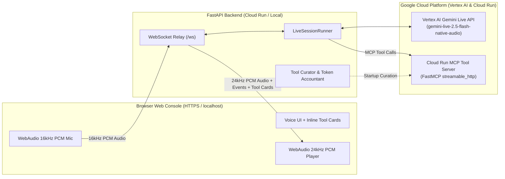

# Gemini Live — Enterprise Bidirectional Voice Assistant Boilerplate (Vertex AI)

A production-ready, config-driven **Gemini Live API** voice agent built on **Google Cloud Vertex AI** (`gemini-live-2.5-flash-native-audio`), featuring:

1. **Agent Identity & Strict Gender Consistency (`agent.name` & `agent.gender`)** — Prevents mixing male and female voices or grammatical verb forms across all 30 prebuilt Gemini voices and 70 languages (including gendered Indian languages like Hindi, Hinglish, Marathi, Gujarati, Punjabi, and Urdu).
2. **Default Indian Accent with Dynamic Language Switching** — Opens in Indian English (`en-IN`) or the browser's locale (`use_client_locale: true`), dynamically switches language mid-conversation (`language_mode: follow_user`) as soon as the user does, and preserves a warm Indian vocal accent (`default_accent: Indian`) across every language.
3. **Topic Restriction Guardrail (`model.talk_only_about`)** — Enforces domain-scoped conversations via system-instruction rules so the assistant strictly stays within your configured enterprise scope.
4. **Live MCP Tool Integration & Inline UI Cards** — Connects to remote **Model Context Protocol (MCP)** servers over `streamable_http` (deployed on Cloud Run), curates tools under a token budget, and renders live `.tool-card` call/response cards (with tool round-trip latency in `ms`) directly inside the browser conversation stream.
5. **Per-Turn Latency & Cloud Monitoring Telemetry (`gemini-live-telemetry`)** — Integrates [`gemini-live-telemetry`](https://pypi.org/project/gemini-live-telemetry/) ([GitHub](https://github.com/kkrishnan90/gemini-live-telemetry)) to automatically instrument `google-genai` `AsyncLive.connect` and `AsyncSession` methods via `wrapt`, exporting 21 OpenTelemetry counters/histograms (`gemini_live.turn.ttfb_ms`, `gemini_live.turn.duration_ms`, `gemini_live.session.setup_latency_ms`, `gemini_live.tool.round_trip_ms`) to **Google Cloud Monitoring** (`Gemini Live API Metrics` dashboard), local JSONL/JSON snapshots (`./metrics/`), `/api/telemetry`, and an interactive **Latency per Turn** bar chart in the Web Console UI.
6. **Honest Token & Context-Rent Accounting** — Tracks per-turn and per-session prompt, cached, response, tool-use, and thinking tokens by modality (`AUDIO` vs `TEXT`), with automatic context-window sliding compression.

---

## Live Cloud Run Deployments & Dashboards

| Service / Dashboard | HTTPS Endpoint | Description |
| :--- | :--- | :--- |
| **Gemini Live Voice Console** | **[`https://gemini-live-app-1047195478355.us-central1.run.app`](https://gemini-live-app-1047195478355.us-central1.run.app)** | Full Web UI & WebSocket relay (`Ananya · Female · Kore`) with live per-turn TTFB & duration dashboard. |
| **Enterprise MCP Tool Server** | **[`https://gemini-live-mcp-tools-1047195478355.us-central1.run.app/mcp`](https://gemini-live-mcp-tools-1047195478355.us-central1.run.app/mcp)** | Stateless `streamable_http` FastMCP server exposing 4 enterprise tools (`lookup_customer_account`, `calculate_loan_emi`, `create_support_ticket`, `get_platform_service_status`). |
| **GCP Cloud Monitoring Dashboard** | **[`Gemini Live API Metrics` (`mb-poc-352009`)](https://console.cloud.google.com/monitoring/dashboards/builder/505c1d9e-fa06-4663-b4b1-d8d7521558bc?project=mb-poc-352009)** | Auto-provisioned Google Cloud Monitoring dashboard charting P50/P95/P99 TTFB, turn duration, session setup latency, and tool round-trip times. |

---

## Architecture



---

## Quick Start (Local Development)

Requires **Python 3.11+** and [`uv`](https://docs.astral.sh/uv/).

```bash
# 1. Install dependencies
uv sync --extra dev

# 2. Configure Google Cloud project & authentication
export GOOGLE_CLOUD_PROJECT=mb-poc-352009
gcloud auth login
gcloud auth application-default login

# 3. Verify Vertex AI & configuration health
uv run glive validate-config
uv run glive doctor

# 4. Start the local web server
uv run glive serve --host 127.0.0.1 --port 8080
```

Open **`http://localhost:8080`** in Chrome and click **Start call**.
- **Start call** opens the WebSocket and initiates the Vertex AI Live session.
- **Stop call** immediately hangs up, flushes final token metrics, and terminates the Live session server-side so billing stops.

---

## Key Configuration (`config/config.yaml`)

All settings live in [`config/config.yaml`](config/config.yaml) and are strictly validated by Pydantic (`extra="forbid"`).

### 1. Agent Identity & Anti-Gender-Mixing (`agent`)

```yaml
agent:
  name: Ananya
  gender: female # female | male
  enforce_in_system_instruction: true
```

- **No Male/Female Mixing**:
  1. **Voice Validation**: Every one of the 30 prebuilt Gemini Live voices is classified by gender in [`voices.py`](src/gemini_live/settings/voices.py) (`14 female`, `16 male`). If `agent.gender: female` is paired with a male voice (like `Puck` or `Fenrir`) or vice versa, startup validation immediately raises a `ValueError` refusing to mix genders.
  2. **Grammatical Gender Consistency**: In languages with gendered first-person grammar (Hindi, Hinglish, Marathi, Gujarati, Punjabi, Urdu), [`agent_identity_directive()`](src/gemini_live/settings/voices.py) instructs the model to strictly use matching verb conjugations in every sentence (e.g., for female: *"karungi"*, *"dekhti hoon"*, *"bata rahi hoon"*; never male forms like *"karunga"* or *"bata raha hoon"*).

### 2. Default Indian Accent & Dynamic Language Switching (`speech`)

```yaml
speech:
  default_accent: Indian
  voice_name: Kore               # Female voice matching agent.gender: female
  language_code: en-IN           # Opening language / fallback
  language_mode: follow_user     # Dynamically switches to whatever language the user speaks
  use_client_locale: true        # Uses browser navigator.language when supported
  enforce_language_in_system_instruction: true
```

Run `uv run glive voices` to view all 30 voices (with their gender and character) and all 70 supported languages:

```bash
uv run glive voices
```

### 3. Topic Restriction Guardrail (`model.talk_only_about`)

```yaml
model:
  name: gemini-live-2.5-flash-native-audio
  response_modalities: ["AUDIO"]
  talk_only_about: "Enterprise customer CRM accounts, loan EMI financial calculations, IT support tickets, and cloud platform service health"
```

When set, the system instruction enforces that the assistant only discusses this topic and politely declines off-topic questions.

### 4. Remote Cloud Run MCP Toolset (`tools.mcp`)

```yaml
tools:
  curation:
    mode: auto
    purpose: "Enterprise customer CRM lookup, loan EMI calculation, support ticket creation, platform health status, and current time."
    max_tools: 20
    budget_tokens: 6000
  pinned: ["crm_ops__*"]
  mcp:
    - name: crm_ops
      enabled: true
      transport: streamable_http
      url: https://gemini-live-mcp-tools-1047195478355.us-central1.run.app/mcp
      startup_timeout_s: 20.0
```

Inspect tool curation and token costs anytime with:

```bash
uv run glive tools explain
```

---

## Testing the MCP Tools from Terminal

You can test a full multi-turn Live API conversation with the Cloud Run MCP server directly from your terminal (without a browser or microphone) using the included test script:

```bash
uv run python scripts/test_mcp_conversation.py
```

Or run a quick single-turn self-test via the CLI:

```bash
uv run glive selftest --prompt "Look up customer account CUST-101 and calculate the monthly EMI for a 500,000 INR loan at 9.5% for 36 months."
```

---

## Deploying to Google Cloud Run

### 1. Deploy the Custom MCP Server (`mcp_server/`)

```bash
gcloud run deploy gemini-live-mcp-tools \
  --source ./mcp_server \
  --region us-central1 \
  --project "$GOOGLE_CLOUD_PROJECT" \
  --allow-unauthenticated
```

### 2. Deploy the Gemini Live Web Application (Root `Dockerfile`)

```bash
gcloud run deploy gemini-live-app \
  --source . \
  --region us-central1 \
  --project "$GOOGLE_CLOUD_PROJECT" \
  --allow-unauthenticated \
  --timeout 3600 \
  --session-affinity \
  --set-env-vars GOOGLE_CLOUD_PROJECT="$GOOGLE_CLOUD_PROJECT"
```

---

## CLI Reference

| Command | Description |
| :--- | :--- |
| `uv run glive serve` | Start the FastAPI web server and WebSocket Live relay |
| `uv run glive validate-config` | Validate `config/config.yaml` and print the resolved configuration tree |
| `uv run glive doctor` | Verify Google Cloud credentials, Vertex AI reachability, and token counting |
| `uv run glive voices` | Display all 30 prebuilt voices (with gender & character) and 70 languages |
| `uv run glive tools explain` | Inspect MCP tool curation scores, token costs per turn, and 30-turn projections |
| `uv run glive selftest` | Run a headless Live session exercising tool calls and token accounting |
| `uv run glive usage-report` | Analyze recorded session token usage logs from `logs/usage.jsonl` |
| `uv run glive calibrate-usage` | Empirically test whether model token counters are cumulative or delta |

---

## Repository Structure

```text
.
├── config/
│   ├── config.yaml              # Primary reference configuration (annotated)
│   └── config.minimal.yaml      # Minimal configuration template
├── mcp_server/                  # Custom FastMCP Enterprise Tool Server (Cloud Run)
│   ├── server.py                # 4 CRM/EMI/Ticket/Status tools (streamable_http)
│   ├── Dockerfile               # Container definition for Cloud Run MCP service
│   └── requirements.txt
├── scripts/
│   └── test_mcp_conversation.py # Headless terminal test script for Live + MCP tools
├── src/gemini_live/
│   ├── cli.py                   # `glive` Typer CLI implementation
│   ├── pipeline.py              # Startup MCP tool discovery & embedding curation
│   ├── live/
│   │   ├── client.py            # Vertex AI client with self-refreshing gcloud/ADC auth
│   │   ├── connect_config.py    # System instruction & LiveConnectConfig builder
│   │   └── runner.py            # Bidirectional audio/text/tool session loop & reconnects
│   ├── server/
│   │   ├── app.py               # FastAPI server & WebSocket endpoint (/ws)
│   │   └── static/              # Web Console UI (index.html, app.js, styles.css, worklets)
│   ├── settings/
│   │   ├── schema.py            # Pydantic config models & gender coherence validator
│   │   └── voices.py            # 30-voice gender catalog & language/identity directives
│   ├── tools/                   # MCP client adapter, schema compaction, & registry
│   └── usage/                   # Per-turn & per-session token accountant
├── tests/                       # 313 unit tests covering config, voices, runner, MCP, & UI
├── Dockerfile                   # Production container for Gemini Live Web Console
└── pyproject.toml
```

---

## Development & Verification

```bash
# Run the complete unit test suite (313 tests)
uv run pytest -q

# Run linter and formatting checks
uv run ruff check src tests mcp_server scripts

# Run strict static type checking
uv run mypy --check-untyped-defs src tests mcp_server scripts
```
